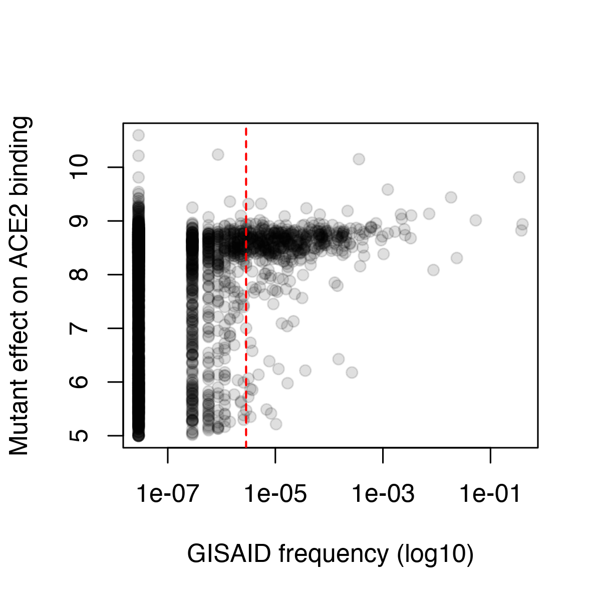
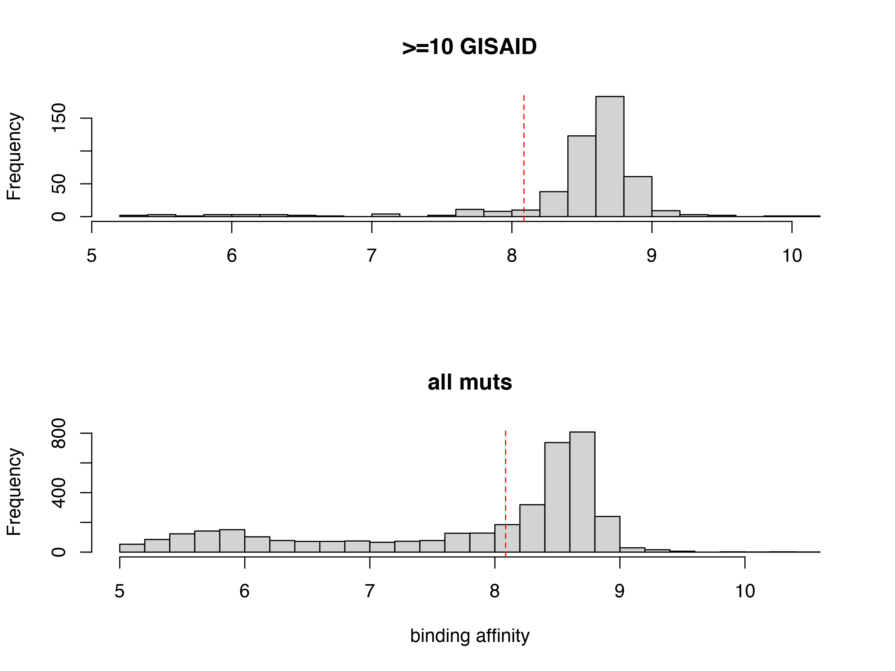

analyze space of tolerated muts
================
tns
3/3/2022

Synthesize different functional and evolutionary metrics to approximate
the space of realized and possible coronavirus evolution

``` r
require("knitr")
knitr::opts_chunk$set(echo = T)
knitr::opts_chunk$set(dev.args = list(png = list(type = "cairo")))

#list of packages to install/load
packages = c("data.table","tidyverse","bio3d")
#install any packages not already installed
installed_packages <- packages %in% rownames(installed.packages())
if(any(installed_packages == F)){
  install.packages(packages[!installed_packages])
}
#load packages
invisible(lapply(packages, library, character.only=T))

#make output directory
output_dir <- "./results"
if(!file.exists(output_dir)){
  dir.create(file.path(output_dir))
}
```

Read in data: SARS-CoV-2 DMS data, GISAID mutation counts, and
sarbecovirus diversity

``` r
dt_dms <- data.table(read.csv(file="data/dms_scores.csv",stringsAsFactors=F))
dt_dms <- dt_dms[target=="Wuhan-Hu-1",]
#remove synonymous muts
dt_dms <- dt_dms[mutant!=wildtype,]

dt_gisaid <- data.table(read.csv(file="data/gisaid_mutation_counts.csv",stringsAsFactors=F))

dt_alignment <- bio3d::read.fasta(file="data/RBDs_aa_aligned_v3.fasta",rm.dup=F)
```

First, annotate mutations that have been observed during SARS-CoV-2
genomic surveillance with some appreciable frequency.

``` r
#add gisaid counts to dms scores table
dt_dms[,gisaid_count:=0];dt_dms[,gisaid_frequency:=0]
for(i in 1:nrow(dt_gisaid)){
  dt_dms[position==as.numeric(dt_gisaid[i,"site"]) & mutant==dt_gisaid[i,"mutant"],gisaid_count:=dt_gisaid[i,"count"]]
  dt_dms[position==as.numeric(dt_gisaid[i,"site"]) & mutant==dt_gisaid[i,"mutant"],gisaid_frequency:=dt_gisaid[i,"frequency"]]
}

#add a 'pseudo-frequency' for visualizaiton of count=0 on log plot
dt_dms[,pseudo_frequency:=gisaid_frequency]
dt_dms[gisaid_frequency==0,pseudo_frequency:=0.1*min(dt_dms[gisaid_frequency>0,gisaid_frequency])]

count_threshold <- 10
plot(dt_dms$pseudo_frequency, dt_dms$bind,pch=19,col="#00000020",log="x", xlab="GISAID frequency (log10)",ylab="Mutant effect on ACE2 binding")
abline(v=dt_dms[gisaid_count==count_threshold,pseudo_frequency],lty=2,col="red")
```



``` r
#indicator variable for observed in SARS2 at appreciable count
dt_dms[,observed_SARS2 := 0]
dt_dms[gisaid_count >= count_threshold, observed_SARS2 := 1]
```

Next, add an indicator of whether a mutation is tolerated with respect
to mutational impact on ACE2 binding affinity. Define a threshold
relative to the range of ACE2 binding values that have been seen among
mutations with appreciable frequency on GISAID.

``` r
#want to pick a threshold of binding to state tolerated mutations. Let's see the 10%ile of binding scores of mutations with >=10 occurrences?
threshold <- quantile(dt_dms[observed_SARS2==1,bind],probs=0.1,na.rm=T)
#just to note to self, this threshold basically becomes the same value as K417N. That actually seems reasonable?

par(mfrow=c(2,1))
hist(dt_dms[gisaid_count >=10,bind],main=">=10 GISAID",xlab="",breaks=20)
abline(v=threshold,lty=2,col="red")
hist(dt_dms[,bind],main="all muts",xlab="binding affinity",breaks=20)
abline(v=threshold,lty=2,col="red")
```



``` r
#indicator for "tolerated" at this threshold
dt_dms[,tolerated_DMS := 0]
dt_dms[bind >=threshold, tolerated_DMS := 1]
```

Next, add an indicator of whether a mutation is observed in an alignment
of SARS-related coronaviruses, excluding the “Clade 2” sequences that do
not apparently utilize ACE2 as a receptor even in their native bat
hosts.

``` r
#annotate whether a mutation has been observed in other sarbecoviruses
dt_dms[,observed_sarbeco := 0]

#iterate through columns and annotate any subs
site <- 331
for(i in 1:ncol(dt_alignment$ali)){
  if(dt_alignment$ali[1,i] != "-"){
    sars2_aa <- dt_alignment$ali[1,i]
    all_aa <- unique(dt_alignment$ali[,i])
    dt_dms[position==site & mutant %in% all_aa & wildtype==sars2_aa,observed_sarbeco:=1]
    site <- site+1
  }
}

#note, observed_sarbeco was 352 muts when clade2 was included
```

Last, add an indicator of what mutations are in Omicron BA.1

``` r
#annotate whether a mutation has been observed in other sarbecoviruses
dt_dms[,observed_omicron_BA1 := 0]

dt_dms[mutation %in% c("N501Y","S477N","N440K","G339D","T478K","S373P","Q498R","E484A","S371L","Q493R","G446S","S375P","K417N","G496S","Y505H"),
       observed_omicron_BA1:=1]
```

Save csv with the indicators

``` r
write.csv(dt_dms[,.(wildtype,position,mutant,mutation,observed_omicron_BA1,observed_SARS2,observed_sarbeco,tolerated_DMS)],
          file="./results/mutation-specs.csv",row.names=F,quote=F)
```
